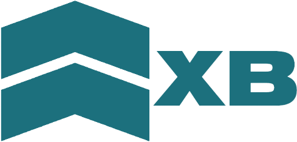
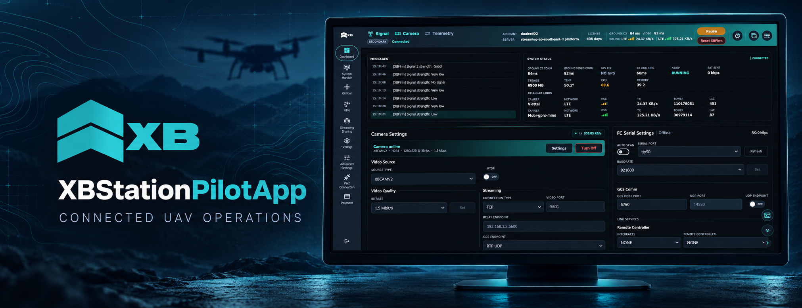
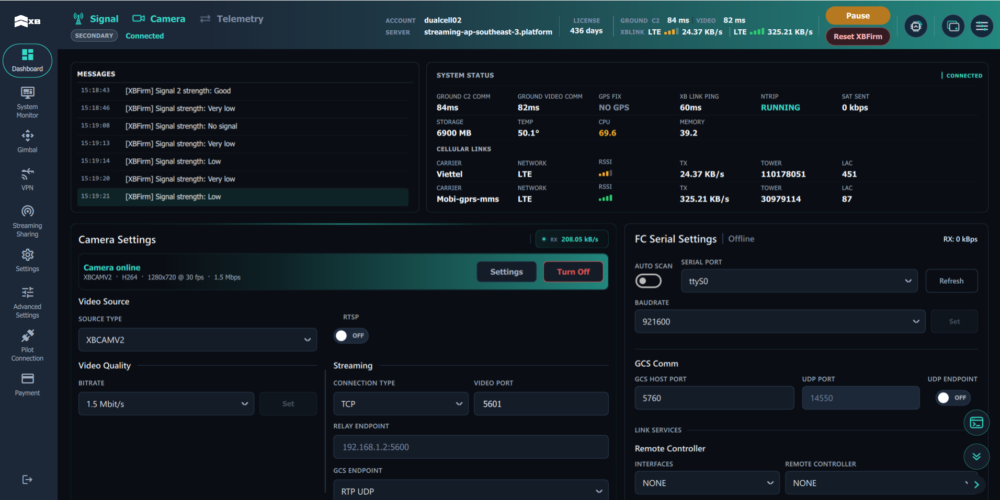

  

<h1 align="center">XBStationPilotApp</h1>

  Connected UAV operations, video and telemetry in one focused desktop experience.

  <a href="https://github.com/xb-uav/XBStationPilotApp/releases/latest"><strong>Download latest release</strong></a>
  ·
  <a href="#core-capabilities">Features</a>
  ·
  <a href="#interface-preview">Interface</a>
   
  <a href="https://xbstation.com/">Website</a>
  ·
  <a href="https://xbstation.com/solution/platform">Platform</a>
  ·
  <a href="https://docs.xbstation.com/">Documentation</a>
  ·
  <a href="https://xbstation.com/about-us">About</a>
  ·
  <a href="https://xbstation.com/contact">Contact</a>

  
  

## About

**XBStationPilotApp** is the desktop application for operating connected UAV systems through the XBStation platform. It brings communication status, live video, telemetry, device control and operational settings into a single interface for the pilot workstation.

The application is designed to work with XBStation services and XBLink deployments. Available functions depend on the connected hardware, account and platform configuration.

## Core capabilities

| | Capability | What it provides |
| --- | --- | --- |
| **01** | **Signal and connectivity** | A clear view of ground C2, video links, latency and cellular connection status. |
| **02** | **Camera and streaming** | Camera selection, video quality controls, stream endpoints and live connection feedback. |
| **03** | **Telemetry integration** | Serial and network settings for connecting flight-controller data to supported ground-control workflows. |
| **04** | **System monitoring** | Device health, storage, temperature, CPU, memory and service status in one dashboard. |
| **05** | **Payload workflows** | Access to gimbal, mapping and other connected-device tools available for the deployment. |
| **06** | **Version management** | Discover, download and switch between supported Pilot App releases through the launcher workflow. |

## One operational workspace

The interface is organized around the information a pilot needs during setup and operation:

- **Signal** for connectivity and link state;
- **Camera** for video sources and streaming configuration;
- **Telemetry** for flight-controller communication;
- **Dashboard** for messages, system status and active services;
- dedicated views for monitoring, gimbal control, VPN, sharing and application settings.

## Interface preview

The screenshot below shows the current desktop dashboard with live connection status, camera settings and flight-controller communication controls.

## Get started

1. Open the [latest release](https://github.com/xb-uav/XBStationPilotApp/releases/latest).
2. Download the Windows x64 package.
3. Extract the package to a writable location.
4. Start `XBStationPilotApp.exe`.

For managed installation, downloads and version switching, use [XBStation Pilot App Launcher](https://github.com/xb-uav/pilot-app-launcher/releases/latest).

## Platform availability

| Platform | Status |
| --- | --- |
| **Windows x64** | **Available** |
| **macOS** | **Coming soon** |
| **Linux** | **Coming soon** |
| **Android** | **Coming soon** |

> An internet connection and valid XBStation access may be required, depending on the selected connection mode and deployment.

## Support

For product questions, deployment support or feedback, visit the [XBStation contact page](https://xbstation.com/contact).

---

  Part of the <a href="https://xbstation.com/solution/platform">XBStation Pilot Operations Platform</a>.

